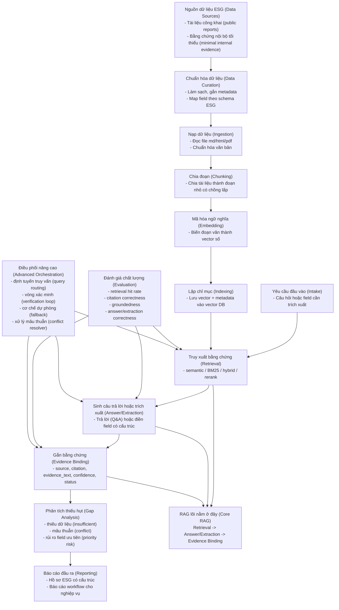

```mermaid
flowchart TD
    A["Nguồn dữ liệu ESG (Data Sources)<br/>- Tài liệu công khai (public reports)<br/>- Bằng chứng nội bộ tối thiểu (minimal internal evidence)"] --> B["Chuẩn hóa dữ liệu (Data Curation)<br/>- Làm sạch, gắn metadata<br/>- Map field theo schema ESG"]
    B --> C["Nạp dữ liệu (Ingestion)<br/>- Đọc file md/html/pdf<br/>- Chuẩn hóa văn bản"]
    C --> D["Chia đoạn (Chunking)<br/>- Chia tài liệu thành đoạn nhỏ có chồng lấp"]
    D --> E["Mã hóa ngữ nghĩa (Embedding)<br/>- Biến đoạn văn thành vector số"]
    E --> F["Lập chỉ mục (Indexing)<br/>- Lưu vector + metadata vào vector DB"]

    G["Yêu cầu đầu vào (Intake)<br/>- Câu hỏi hoặc field cần trích xuất"] --> H["Truy xuất bằng chứng (Retrieval)<br/>- semantic / BM25 / hybrid / rerank"]
    F --> H

    H --> I["Sinh câu trả lời hoặc trích xuất (Answer/Extraction)<br/>- Trả lời (Q&A) hoặc điền field có cấu trúc"]
    I --> J["Gắn bằng chứng (Evidence Binding)<br/>- source, citation, evidence_text, confidence, status"]

    J --> K["Phân tích thiếu hụt (Gap Analysis)<br/>- thiếu dữ liệu (insufficient)<br/>- mâu thuẫn (conflict)<br/>- rủi ro field ưu tiên (priority risk)"]
    K --> L["Báo cáo đầu ra (Reporting)<br/>- Hồ sơ ESG có cấu trúc<br/>- Báo cáo workflow cho nghiệp vụ"]

    M["Đánh giá chất lượng (Evaluation)<br/>- retrieval hit rate<br/>- citation correctness<br/>- groundedness<br/>- answer/extraction correctness"] --> H
    M --> I
    M --> J

    N["Điều phối nâng cao (Advanced Orchestration)<br/>- định tuyến truy vấn (query routing)<br/>- vòng xác minh (verification loop)<br/>- cơ chế dự phòng (fallback)<br/>- xử lý mâu thuẫn (conflict resolver)"] --> H
    N --> I
    N --> J

    O["RAG lõi nằm ở đây (Core RAG)<br/>Retrieval -> Answer/Extraction -> Evidence Binding"]
    H --> O
    I --> O
    J --> O
```
