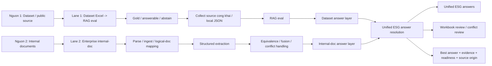

# Tong hop he thong ESG: Dataset lane, Internal-doc lane va lop hop nhat ket qua

Ngay: 2026-06-19

## 1. Muc dich tai lieu

Tai lieu nay tong hop toan canh he thong hien tai de cac thanh vien trong team cung dung chung mot cach hieu va mot cach van hanh.

He thong khong nen duoc hieu la 2 bai toan tach biet, ma la:

- **2 nguon dau vao**
  - `dataset/public source`
  - `internal documents`
- **2 lane xu ly**
  - lane benchmark / eval
  - lane structured extraction tu tai lieu doanh nghiep
- **1 lop ket qua hop nhat**
  - `unified ESG answer resolution`

Muc tieu cuoi cung cua he thong la:

1. tim ra cau tra loi ESG tot nhat tu toan bo du lieu co duoc
2. gan evidence ro rang
3. phat hien va gan co conflict neu co
4. xuat ra ket qua ESG co cau truc, san sang cho review va bao cao

## 2. Tong quan kien truc hop nhat

## 3. Nguon dau vao va vai tro cua tung lane

## 3.1. Nguon 1: Dataset / public source

### Muc tieu

Nguon nay dung de benchmark chat luong RAG tren bo cau hoi ESG da co dap an tham chieu va provenance cong khai.

### Dau vao

- file Excel ESG
- gold / dap an tham chieu
- `Source URL` hoac local JSON/provenance

### He thong da lam gi

1. ingest workbook
2. chuan hoa `question_id`, `answerable_gold`, `abstain_gold`
3. collect source cong khai / local source
4. build corpus
5. chay RAG eval
6. so sanh voi gold
7. xuat `metrics`, `score`, workbook compare

### Dau ra chinh

- `metrics`
- `score`
- answer layer tu lane dataset
- workbook so sanh de review

### Cau hoi lane nay tra loi

`RAG hien dung den dau so voi bo gold va source cong khai?`

## 3.2. Nguon 2: Internal documents

### Muc tieu

Nguon nay dung de xu ly tai lieu doanh nghiep that va chuyen thanh du lieu ESG co cau truc.

### Dau vao

- tai lieu doanh nghiep nhieu dinh dang
- co the gom: `markdown`, `html`, `xml`, `pdf`, `json`, `csv`

### He thong da lam gi

1. parse / ingest tai lieu
2. tao `corpus_units`
3. map `logical documents`
4. retrieval theo family / logical doc
5. `cross-role extraction`
6. `equivalence collapse`
7. `evidence fusion`
8. `conflict classification`
9. `readiness promotion`
10. chay onboarding gate
11. phan loai `corpus_limited` va `system_gap`

### Dau ra chinh

- `structured ESG data`
- evidence
- `readiness_state`
- `conflict_status`
- answer layer tu lane internal-doc

### Cau hoi lane nay tra loi

`He thong co chuyen duoc tai lieu doanh nghiep thanh ESG structured data khong?`

## 4. Lop hop nhat: Unified ESG answer resolution

Day la lop moi nhat va la cach nhin nghiep vu dung cho toan he thong.

Thay vi coi 2 lane la 2 bai toan rieng, lop nay coi:

- lane dataset = mot nguon answer
- lane internal-doc = mot nguon answer

Va thuc hien bai toan:

`chon ra cau tra loi ESG tot nhat tu tat ca nguon hien co`

### 4.1. Dau vao cua lop hop nhat

- answer layer tu lane dataset
- answer layer tu lane internal-doc

### 4.2. Khoa noi (business key)

He thong uu tien map theo:

1. `question_id`
2. fallback theo business key:
   - `company_id`
   - `family_id`
   - `metric_name`
   - `year`

### 4.3. Cac status nghiep vu chinh

- `MATCH_CONFIRMED`
- `BACKFILL_FROM_DATASET`
- `BACKFILL_FROM_INTERNAL`
- `CONFLICT_REVIEW_REQUIRED`
- `NO_ANSWER_FOUND`
- `INSUFFICIENT_EVIDENCE` neu can

### 4.4. Dau ra cua lop hop nhat

Moi record hop nhat can co:

- business key / identity
- `best_answer`
- `best_answer_origin`
- `supporting_evidence`
- `readiness_state`
- `conflict_status`
- `auto_confirm`
- `review_required`
- `review_owner`

### 4.5. Artifact review

Lop hop nhat khong ghi de Excel goc.

No xuat:

- `unified_answers.jsonl`
- workbook review rieng
- plan review de reviewer / SME xu ly conflict va backfill

## 5. Cach dung he thong trong thuc te

## 5.1. Neu chi co dataset workbook

Chay lane dataset:

1. ingest workbook
2. collect source
3. chay RAG eval
4. xem `metrics`, `score`, workbook compare

## 5.2. Neu chi co tai lieu doanh nghiep

Chay lane internal-doc:

1. bootstrap cong ty moi
2. ingest tai lieu
3. tao probes / natural cases
4. chay onboarding gate
5. review `corpus_limited` / `system_gap`

## 5.3. Neu co ca dataset workbook va tai lieu doanh nghiep

Day la truong hop day du nhat, va can chay theo flow sau:

1. chay lane dataset de co answer layer tu source cong khai
2. chay lane internal-doc de co structured ESG answer layer tu tai lieu doanh nghiep
3. chay `unified ESG answer resolution`
4. xuat:
   - `best answer`
   - evidence
   - backfill / conflict review

Day la flow nghiep vu day du va dung nhat cua he thong.

## 6. Cach doc loi va quy tac xu ly

## 6.1. Trong lane dataset

- Neu retrieval / extraction sai so voi gold -> mo workstream cai thien RAG
- Neu provenance thieu -> xem lai source intake / source registry

## 6.2. Trong lane internal-doc

- Neu `corpus_limited` -> thieu tai lieu hoac thieu overlap that, khong harden pipeline loi
- Neu `system_gap` -> co candidate nhung extraction / fusion / equivalence fail, harden theo `family_id`
- Neu parser fail -> quay lai parser lane

## 6.3. Trong lop hop nhat

- `MATCH_CONFIRMED` -> co the auto-confirm
- `BACKFILL_FROM_INTERNAL` -> bo sung answer tu tai lieu noi bo
- `BACKFILL_FROM_DATASET` -> dung answer tu lane cong khai
- `CONFLICT_REVIEW_REQUIRED` -> dua cho SME / reviewer
- `NO_ANSWER_FOUND` -> giu trang thai chua resolve

## 7. Trang thai hien tai cua he thong

## 7.1. Lane dataset

- da co flow benchmark day du
- da co `metrics`, `score`, workbook compare
- san sang cho bai toan ESG cong khai co gold

## 7.2. Lane internal-doc

- core capability da harden xong
- onboarding gate da dong goi xong
- bootstrap kit / SOP / templates da co
- trang thai hien tai: `done_until_real_data`

## 7.3. Lop hop nhat

- da co `unified ESG answer resolution`
- da co rule chon `best answer`
- da co workbook review rieng
- da san sang cho truong hop co cung `company_id` o ca 2 nguon

## 8. Team can nho dieu gi

1. Khong coi `dataset` va `internal-doc` la 2 bai toan nghiep vu tach biet.
2. Day la 2 nguon dau vao cua cung mot bai toan ESG.
3. Benchmark va structured extraction van can tach lane de debug cho ro.
4. Nhung ket qua cuoi cung phai duoc nhin o lop `unified ESG answer`.

## 9. Flow ngan nhat khi co cong ty moi

### Truong hop A: chi co dataset

1. ingest workbook
2. collect source
3. chay RAG eval
4. bao cao `metrics/score`

### Truong hop B: chi co tai lieu doanh nghiep

1. bootstrap cong ty moi
2. ingest tai lieu
3. tao probes / natural cases
4. chay onboarding gate
5. review theo SOP

### Truong hop C: co ca 2

1. chay lane dataset
2. chay lane internal-doc
3. chay `unified ESG answer resolution`
4. review `MATCH / BACKFILL / CONFLICT / NO_RESULT`
5. xuat ket qua ESG hop nhat

## 10. Ket luan

He thong hien tai da duoc hieu dung theo 3 lop:

1. **Nguon dau vao**
   - dataset / public source
   - internal documents
2. **Lane xu ly**
   - lane benchmark / eval
   - lane structured extraction
3. **Lop ket qua hop nhat**
   - `unified ESG answer resolution`

O thoi diem hien tai:

- lane dataset da san sang cho benchmark va bao cao `metrics/score`
- lane internal-doc da san sang cho du lieu doanh nghiep that
- lop hop nhat da san sang de chon `best ESG answer` va xuat review artifact ma khong sua Excel goc

Tai lieu nay la phien ban dung chung de team cung ap dung, khong can giai thich lai tu dau qua chat.
