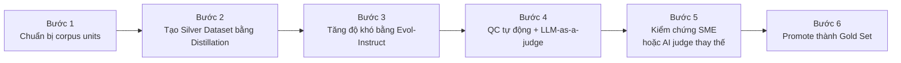

# Báo cáo công việc ngày 2026-06-11

## 1. Công việc chính: Xây dựng Golden Set ESG

Mục tiêu hiện tại là xây một `Golden Set` theo hướng `Silver -> Gold`.  
Phần này **chưa chốt kết quả cuối**, nên báo cáo chỉ mô tả **đúng quy trình 6 bước** theo tài liệu workflow.

### Sơ đồ tổng quan

### Bước 1. Chuẩn bị corpus units

Đầu vào là dữ liệu ESG trong các package `company_export_json`.  
Ở bước này, hệ thống tách và chuẩn bị các `corpus units` làm nguyên liệu để sinh câu hỏi.

Những việc chính:
- đọc các đoạn văn/record từ `jsonl`
- gắn metadata như:
  - `company`
  - `record_id`
  - `source`
  - `section`
  - các mã chuẩn ESG nếu có
- tạo tập `corpus units` đủ sạch để làm đầu vào cho bước sinh Silver

Ý nghĩa:
- chuẩn hóa đầu vào
- giúp mọi câu hỏi sinh ra sau này đều truy ngược được về nguồn

### Bước 2. Tạo Silver Dataset bằng Distillation

Đây là bước dùng LLM để sinh bộ `Silver Dataset` ban đầu từ các `corpus units`.

Những việc chính:
- cho LLM đọc context
- sinh ra các cặp `question - answer`
- giữ grounding theo context đang có
- tạo ra một tập Silver lớn, nhanh, rẻ hơn so với làm tay

Ý nghĩa:
- tạo ra lớp dữ liệu trung gian đủ rộng
- dùng để chọn lọc dần trước khi lên Gold

### Bước 3. Tăng độ khó bằng Evol-Instruct

Sau khi có Silver cơ bản, hệ thống nâng cấp một phần câu hỏi để tránh chỉ toàn câu đơn giản.

Những việc chính:
- biến đổi câu hỏi simple thành câu hỏi:
  - cần suy luận hơn
  - cần đối chiếu nhiều ý hơn
  - khó hơn nhưng vẫn bám context
- giữ đa dạng kiểu câu hỏi cho evaluation

Ý nghĩa:
- tránh việc Silver chỉ gồm các câu quá dễ
- giúp bộ đánh giá sau này phản ánh tốt hơn năng lực RAG thật

### Bước 4. QC tự động + LLM-as-a-judge

Đây là bước lọc tự động để loại bớt các mẫu Silver kém chất lượng trước khi đưa sang review.

Những việc chính:
- kiểm tra `answerability`: có trả lời được từ context hay không
- kiểm tra `difficulty`: có quá dễ hoặc quá copy-paste không
- kiểm tra `groundedness`: câu trả lời có bám context không
- dùng `LLM-as-a-judge` để chấm/lọc sơ bộ

Ý nghĩa:
- giảm tải cho vòng SME review
- chỉ giữ lại những mẫu Silver đáng để con người hoặc AI judge xem tiếp

### Bước 5. Kiểm chứng SME hoặc AI judge thay thế

Đây là bước kiểm chứng chất lượng ở mức gần cuối.

Những việc chính:
- reviewer/SME xem lại câu hỏi, đáp án, context
- xác nhận mẫu nào đủ đúng để giữ lại
- sửa các mẫu cần chỉnh
- nếu chưa có SME đầy đủ, có thể dùng `AI judge` như một lớp thay thế tạm thời để giảm khối lượng review tay

Ý nghĩa:
- chuyển từ “mẫu do LLM sinh” sang “mẫu đã được kiểm chứng”
- tăng độ tin cậy trước khi promote thành Gold

### Bước 6. Promote thành Gold Set

Sau khi đã qua QC và bước kiểm chứng, các mẫu đạt yêu cầu sẽ được promote thành `Gold Set`.

Những việc chính:
- chọn các mẫu đã được approve
- ghi ra file Gold chính thức
- dùng làm `source of truth` cho evaluation và regression sau này

Ý nghĩa:
- tạo ra bộ dữ liệu chuẩn để đo chất lượng RAG
- đây mới là đầu vào nên dùng cho benchmark/eval ổn định

Quy trình 6 bước hiện tại đi theo thứ tự:

1. chuẩn bị `corpus units`
2. tạo `Silver Dataset` bằng `Distillation`
3. tăng độ khó bằng `Evol-Instruct`
4. QC tự động + `LLM-as-a-judge`
5. kiểm chứng bằng `SME` hoặc `AI judge` thay thế
6. promote thành `Gold Set`

Mục tiêu là đi từ tập Silver sinh tự động sang một tập Gold đã được kiểm chứng đủ chặt để dùng cho evaluation.

---

## 2. Công việc chính: Sửa LangGraph staging retrieval

Phần này tập trung vào việc làm cho `LangGraph staging retrieval` trả kết quả đúng hơn với dữ liệu ESG hiện có.

### Nguyên nhân chính

Có ba nguyên nhân lớn:

1. **Noise trong dữ liệu**
- passage đang lẫn `news chrome`, `listing`, `meta`, `cross-company`
- khiến retrieval dễ kéo về đoạn không đúng trọng tâm

2. **Bị bỏ qua đặc thù tiếng Hàn**
- câu hỏi và corpus chủ yếu là tiếng Hàn
- nhưng tầng lexical/BM25 trước đó chưa xử lý tốt Korean tokenization
- dẫn tới việc truy hồi bằng keyword hoạt động kém

3. **Chưa đi qua rerank đúng nghĩa**
- cấu hình có thể bật retrieval mode/rerank
- nhưng nếu service staging không đi qua đúng path runtime
- thì rerank trên thực tế chưa phát huy tác dụng

### Hướng sửa

Hướng sửa hiện tại đi theo 3 lớp:

1. **Giảm tác động của noise**
- giữ việc lọc và nhận diện nhiễu trong dữ liệu retrieval
- tránh để các đoạn `listing/meta/news chrome` chiếm top quá nhiều

2. **Sửa retrieval theo hướng hỗ trợ tiếng Hàn tốt hơn**
- ưu tiên xử lý Korean BM25/tokenization
- để lexical retrieval thực sự có vai trò với câu hỏi tiếng Hàn

3. **Cho staging đi đúng path retrieval + rerank**
- service phải đọc đúng `retrieval_mode`
- runtime phải đi qua đúng hàm retrieval/rerank
- từ đó config bật rerank mới có hiệu lực thật

### Tóm tắt ngắn phần LangGraph

Bài toán của `LangGraph staging retrieval` không chỉ là “đổi config”, mà là:
- dữ liệu còn noise
- retrieval tiếng Hàn chưa được xử lý đủ tốt
- và staging chưa tận dụng đúng rerank

Hướng sửa là:
- giảm noise
- sửa retrieval cho tiếng Hàn
- nối lại đúng đường runtime để rerank hoạt động thật

---

## 3. Kết luận ngắn

Hôm nay có 2 việc chính:

1. Chuẩn hóa lại cách làm `Golden Set` thành quy trình 6 bước dễ review, dễ mở rộng.
2. Làm rõ nguyên nhân và hướng sửa cho `LangGraph staging retrieval`: noise, tiếng Hàn, và rerank.

Trọng tâm hiện tại là làm đúng quy trình và đúng hướng kỹ thuật trước, chưa chốt kết quả cuối.
