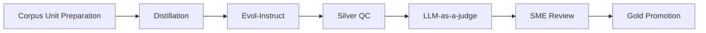

# Golden Set ESG — Phương pháp Round 2 (Silver → Gold)

Generated: 2026-06-10  
Phạm vi: Thiết kế phương pháp và prompt support · **không** sửa pipeline retrieval/benchmark · **không** chạy benchmark

---

## Bối cảnh và hiện trạng

Workstream Golden Set ESG đã chạy pipeline v2 (`data/golden_set/v2/`) với kết quả:

| Bước | Artifact | Kết quả |
|------|----------|---------|
| 1 Corpus Unit | `step1_corpus_units/corpus_units.jsonl` | 118 unit |
| 2 Distillation | `step2_silver/silver_distilled.jsonl` | 118/118 |
| 3 Evol-Instruct | `step3_silver_evolved/silver_evolved.jsonl` | 29 evolved (~25%) |
| 4 Silver QC | `step4_silver_qc/silver_qc_pass.jsonl` | 95 pass / 23 reject |
| 5 LLM-as-a-judge + SME export | `step5_sme_review/sme_review.csv` | 87 approve / 8 reject (AI SME) |
| 6 Gold Promotion | `step6_gold/golden_set.jsonl` | **87 câu Gold** |
| Clean subset | `step6_gold/golden_set_clean.jsonl` | **41 câu** (한샘 29, 무신사 12, 레이시온 0) |

Bài học chính từ `reports/golden_v2_cleaning_report.md`: phần lớn gold bẩn xuất phát từ **bước Distillation** khi corpus chưa lọc đủ (nav/menu, cross-company, listing metadata, vendor generic). Round 2 tập trung **chốt phương pháp** trước khi sinh/cải tiến Silver có kiểm soát.

**6 nguồn chuẩn** (user chốt):

1. `Các Công cụ và Thư viện Mã nguồn mở Hỗ trợ Xây dựng Golden Set cho RAG.md`
2. `Golden Set trong RAG Pipeline_ Khái niệm, Vai trò và Cách xây dựng.md`
3. `Hướng dẫn chi tiết xây dựng Golden Set cho RAG Pipeline.md`
4. `Phân tích và So sánh các Phương pháp Tự động hóa tạo Golden Set cho RAG Pipeline.md`
5. `26.03.27 ESG-정량 - 26.03.27 ESG-정량.csv` (251 dòng)
6. `26.03.27 ESG-정성 - 26.03.27 ESG-정성.csv` (27 dòng)

**Lane dataset** (không nằm trong 6 nguồn phương pháp, nhưng là nguồn evidence thực tế cho Distillation): `data/rag_dataset/05_company_export_json/` — 3 package 한샘, 레이시온, 무신사.

---

## A. Nguồn nào dùng để làm gì?

### A.1. Vai trò 4 file `.md` phương pháp

| # | Tài liệu | Vai trò trong phương pháp Round 2 |
|---|----------|-----------------------------------|
| 1 | **Golden Set trong RAG Pipeline** (Khái niệm, Vai trò…) | **Khung khái niệm**: định nghĩa Golden Set là Source of Truth; cấu trúc 3 lõi Question / Context / Ground Truth; giải thích vì sao cần component-level eval và regression testing; khung **Silver → Gold** 3 bước (sinh Silver → SME review → chốt Gold). Dùng làm **north star** khi thiết kế schema và tiêu chí promote. |
| 2 | **Hướng dẫn chi tiết xây dựng Golden Set** | **Runbook quy trình**: map 1:1 với 7 bước pipeline repo — Data Preparation (Corpus Unit), SDG/Distillation, Automated QC, Human-in-the-loop (SME), Versioning. Cung cấp ví dụ chunking/metadata, mẫu prompt SDG, và checklist Answerability / Difficulty / Groundedness. Dùng để **thiết kế pass/fail** từng bước và artifact đầu ra. |
| 3 | **Phân tích và So sánh các Phương pháp Tự động hóa** | **Lựa chọn kỹ thuật**: so sánh Distillation vs Evol-Instruct vs Multi-Agent vs LLM-as-a-judge; khuyến nghị **kết hợp tuần tự** (Distillation → Evol một phần → Judge → SME). Dùng để **chốt stack Round 2**: không triển khai Multi-Agent full; ưu tiên Distillation có guardrail + Evol có kiểm soát + Judge làm gate trước SME. |
| 4 | **Các Công cụ và Thư viện Mã nguồn mở** | **Tham chiếu metric & tooling**: Ragas (Evolutionary Query, Faithfulness, Answer Relevance), DeepEval (Synthesizer, CI/CD), TruLens (RAG Triad: Groundedness / Context Relevance / Answer Relevance). Dùng để **định nghĩa rubric** (mục D) và đối chiếu metric khi benchmark sau này — **không** bắt buộc đổi stack sang Ragas trong Round 2. |

**Phân công tóm tắt:**

- Tài liệu (1)+(2): *làm gì, theo thứ tự nào, artifact ra sao*
- Tài liệu (3): *chọn Distillation / Evol / Judge thế nào*
- Tài liệu (4): *chấm điểm và công cụ hỗ trợ sau khi đã có Gold*

### A.2. `ESG-정량.csv` — sinh loại câu hỏi nào?

| Thuộc tính | Giá trị |
|------------|---------|
| Quy mô | 251 dòng seed |
| Cột chính | `영역`, `카테고리`, `서브카테고리`, `항목`, `기준 및 설명`, `단위`, `GRI`, `SASB`, `KBIZ`, `K-ESG` |
| Vai trò | **Taxonomy định lượng** — định nghĩa chỉ tiêu ESG có đơn vị, mã chuẩn (GRI/SASB/K-ESG), không gắn giá trị công ty cụ thể |

**Loại câu hỏi ưu tiên sinh từ 정량:**

| `question_type` đề xuất | Mô tả | Ví dụ seed → câu hỏi |
|---------------------------|-------|----------------------|
| `quantitative_fact` | Trích số liệu đơn (count, %, tỷ lệ) | "총 구성원 수는 몇 명인가요?" |
| `quantitative_metric` | Chỉ tiêu có đơn vị và kỳ báo cáo | "2023 회계연도 Scope 1 온실가스 배출량은 얼마인가요?" |
| `quantitative_comparison` | So sánh theo năm / nhóm | "여성 구성원 비율은 전년 대비 어떻게 변했나요?" |
| `quantitative_boolean` | Có/không, đạt/không đạt mục tiêu | "재생에너지 100% 사용 목표를 설정했는가요?" |

**Nguyên tắc gắn evidence:** mỗi câu hỏi 정량 chỉ promote Gold khi `company_evidence` có **giá trị số hoặc câu khẳng định có thể đối chiếu số** trong `sustainability_report` / báo cáo chính thức — không dùng `requirement_taxonomy` làm ground truth.

### A.3. `ESG-정성.csv` — sinh loại câu hỏi nào?

| Thuộc tính | Giá trị |
|------------|---------|
| Quy mô | 27 dòng seed |
| Cột chính | `영역`, `카테고리`, `구분 (4 Pillars)`, `항목`, `설명`, `예시` |
| 4 trụ | Strategy / Governance / Risk Management / Metrics (định tính) |

**Loại câu hỏi ưu tiên sinh từ 정성:**

| `question_type` đề xuất | Trụ 4 Pillars | Mô tả |
|---------------------------|---------------|-------|
| `qualitative_strategy` | Strategy | ESG vision, mid-long strategy, stakeholder integration |
| `qualitative_governance` | Governance | Cơ chế ra quyết định ESG, vai trò HĐQT / ban ESG |
| `qualitative_risk` | Risk Management | Nhận diện và quản lý rủi ro ESG |
| `qualitative_narrative` | Metrics (định tính) | Mô tả chính sách, quy trình, cam kết — không bắt buộc một con số |

**Nguyên tắc gắn evidence:** ưu tiên đoạn narrative trong `official_sustainability_report`; câu trả lời Gold là **tóm tắt grounded** (1–3 câu), không copy nguyên văn dài từ `예시` trong CSV mẫu.

### A.4. Ma trận nguồn × bước pipeline

| Bước | 4 file `.md` | ESG-정량 | ESG-정성 | Company evidence |
|------|-------------|----------|----------|------------------|
| Corpus Unit Preparation | Hướng dẫn Bước 1 | Tham chiếu taxonomy khi gắn `gri_code` / `K-ESG` | Tham chiếu pillar khi gắn `question_type` | **Nguồn chính** — lọc record eligible |
| Distillation | Hướng dẫn Bước 2 + So sánh §1 | Chọn seed metric phù hợp nội dung chunk | Chọn seed narrative phù hợp chunk | Input context |
| Evol-Instruct | So sánh §2 | Evol `in-depth` cho metric phức tạp | Evol `in-breadth` cho governance/risk | Giữ nguyên `record_id` |
| Silver QC | Hướng dẫn Bước 3 | Rule: phải có số/đơn vị trong answer nếu hỏi metric | Rule: không hỏi "ý nghĩa" khi answer chỉ fact | Denylist nav/cross-company |
| LLM-as-a-judge | So sánh §4 + Công cụ (Ragas metric) | Rubric Faithfulness cho số liệu | Rubric Answer Relevancy cho câu dài | Kiểm tra company match |
| SME Review | Khái niệm § Silver→Gold | Xác nhận đơn vị / kỳ báo cáo | Xác nhận wording tự nhiên | Xác nhận đúng công ty |
| Gold Promotion | Hướng dẫn Bước 5 versioning | Tag `quantitative` | Tag `qualitative` | `ground_truth_record_id` bắt buộc |

---

## B. Thiết kế pipeline Silver → Gold cho bài toán ESG



### B.1. Corpus Unit Preparation

| | Nội dung |
|---|----------|
| **Đầu vào** | `company_evidence.jsonl` (3 package); optional `requirement_taxonomy.jsonl` để map mã K-ESG/GRI; denylist từ Round 1 cleaning |
| **Đầu ra** | `corpus_units.jsonl` — mỗi unit: `unit_id`, `record_id`, `company`, `document_type`, `content`, `metadata`, `eligibility_tags` |
| **Pass** | `document_type` ∈ {`sustainability_report`, `esg_disclosure`, `governance_report`}; nội dung ≥ 200 ký tự có ý nghĩa ESG; `company` khớp package; không match pattern nav/menu/listing |
| **Fail** | Nav/menu, trang index, metadata DART thuần ngày/file size, nội dung công ty khác, vendor generic, excerpt quá ngắn |
| **Rủi ro chính** | **Under-filter** (v2: 118 unit nhưng nhiều noisy) → Distillation sinh gold bẩn; **over-filter** → mất coverage 정량 cho 레이시온/무신사 |

**Cải tiến Round 2:** lọc **trước** Distillation theo Grounding Contract (`reports/golden_set_grounding_contract_round1.md`); gắn `taxonomy_seed_id` từ 정량/정성 khi map được.

### B.2. Distillation

| | Nội dung |
|---|----------|
| **Đầu vào** | `corpus_units.jsonl`; optional 1 seed từ 정량 hoặc 정성 phù hợp `document_type` + `영역` |
| **Đầu ra** | `silver_distilled.jsonl` — `question`, `ground_truth_answer`, `ground_truth_record_id`, `context_excerpt`, `question_type`, `difficulty`, `gri_code` |
| **Pass** | Câu hỏi trả lời được **chỉ** từ `context_excerpt`; answer không chứa thông tin ngoài context; `question_type` hợp lệ; không vi phạm forbidden rules (mục kết luận) |
| **Fail** | Hallucination; câu hỏi date-only/nav; câu hỏi về công ty khác; answer copy metadata listing |
| **Rủi ro chính** | **Mode collapse** — câu hỏi lặp cấu trúc; **Teacher bias** — gpt-4o-mini tạo câu dễ quá; **Nguồn bẩn** nếu corpus chưa lọc |

### B.3. Evol-Instruct

| | Nội dung |
|---|----------|
| **Đầu vào** | Subset `silver_distilled.jsonl` (đề xuất 20–30%, ưu tiên `simple` đã pass QC sơ bộ) |
| **Đầu ra** | `silver_evolved.jsonl` — thêm `evolution_type` ∈ {`in-depth`, `in-breadth`, `constrained`, `adversarial`}, `parent_silver_id`, `difficulty` nâng |
| **Pass** | Câu evolved vẫn answerable từ **cùng** `ground_truth_record_id`; độ khó tăng có chủ đích; không đổi company/record |
| **Fail** | Câu hỏi cần multi-record khi chỉ có 1 chunk; câu hỏi suy luận "ý nghĩa/tại sao" mà context chỉ có fact; adversarial gây misleading |
| **Rủi ro chính** | **Unanswerable evolution** — làm tăng reject ở QC; **chi phí token**; đẩy narrative question vào vùng không có evidence |

**Round 2:** chỉ Evol sau khi Distillation Round 2 đã sạch; tỷ lệ ~25% như v2 là hợp lý.

### B.4. Silver QC

| | Nội dung |
|---|----------|
| **Đầu vào** | `silver_distilled.jsonl` ∪ `silver_evolved.jsonl` (dedupe theo `question` + `record_id`) |
| **Đầu ra** | `silver_qc_pass.jsonl`, `silver_qc_reject.jsonl` + `qc_reason` |
| **Pass** | Overlap answer–context (CJK bigram ≥ ngưỡng); không hit denylist; `question`/`answer` cùng ngôn ngữ (KO); độ dài answer hợp lý theo `question_type` |
| **Fail** | `low_context_overlap`, `nav_menu`, `date_only`, `company_mismatch`, `duplicate_question`, `trivial_copy` |
| **Rủi ro chính** | **False pass** — overlap cao nhưng sai fact (v2: một số câu "ý nghĩa" pass QC); **False reject** — ngưỡng overlap quá cao với câu 정성 ngắn |

### B.5. LLM-as-a-judge

| | Nội dung |
|---|----------|
| **Đầu vào** | `silver_qc_pass.jsonl`; rubric 3 trục (mục D); optional gold exemplar từ `golden_set_clean.jsonl` |
| **Đầu ra** | `judge_status` ∈ {`approve`, `reject`, `needs_human`}, `judge_scores` (Faithfulness / Answer Relevancy / Groundedness), `judge_rationale` |
| **Pass** | Cả 3 trục ≥ `pass`; `min_confidence` ≥ 0.75; không vi phạm forbidden rules |
| **Fail** | Bất kỳ trục `fail`; confidence thấp; phát hiện company mismatch hoặc secondary content |
| **Rủi ro chính** | **Judge bias** — approve đồng loạt (v2 AI SME: 87/95); **không thay SME** cho câu 정성 phức tạp; chi phí API |

**Round 2:** tách rõ **AI judge** (bootstrap) vs **SME người** (chốt Gold); câu `needs_human` bắt buộc vào workbook SME.

### B.6. SME Review

| | Nội dung |
|---|----------|
| **Đầu vào** | `sme_review.csv` / `.xlsx` — export từ silver đã judge approve hoặc `needs_human` |
| **Đầu ra** | Cột `sme_decision` ∈ {`approve`, `revise`, `reject`}; optional `sme_revised_question`, `sme_revised_answer`, `sme_notes` |
| **Pass** | SME `approve` hoặc `revise` với answer đã sửa grounded; `forbidden_rule` và `evidence_span_or_note` đã điền |
| **Fail** | `reject`; để trống quyết định; revise nhưng không gắn `record_id` |
| **Rủi ro chính** | **Bottleneck người**; **rubber-stamp** nếu chỉ dùng AI SME; worksheet quá kỹ thuật khiến team Dataset bỏ qua |

### B.7. Gold Promotion

| | Nội dung |
|---|----------|
| **Đầu vào** | `sme_review.csv` với `sme_decision=approve`; schema chuẩn (mục C) |
| **Đầu ra** | `golden_set.jsonl`, `golden_set_clean.jsonl` (sau denylist), eval markdown `eval_set_golden_v2_ko.md` |
| **Pass** | Đủ field bắt buộc; `question_id` unique (prefix `GV2-`); version `golden_version`; một `ground_truth_record_id` / câu |
| **Fail** | Thiếu `ground_truth_record_id`; trùng fact; còn sót denylist |
| **Rủi ro chính** | **Promote sớm** trước khi corpus sạch → phải clean 46/87 như v2; **version drift** nếu không ghi `golden_version` |

---

## C. Schema chuẩn cho một sample Golden Set ESG

Mỗi dòng `golden_set.jsonl` (và workbook SME) nên có **tối thiểu** các field sau:

| Field | Kiểu | Mục đích |
|-------|------|----------|
| `question_id` | string | Khóa bất biến (`GV2-001`); dùng regression, audit, join benchmark |
| `question` | string (KO) | Câu hỏi người dùng / SME — đầu vào pipeline eval |
| `question_type` | enum | Phân loại eval: `quantitative_fact`, `quantitative_metric`, `qualitative_strategy`, `qualitative_governance`, `qualitative_risk`, `qualitative_narrative`, `simple`, `reasoning`, … |
| `company` | string | Công ty mục tiêu (`한샘`, `무신사`, `레이시온`) — filter benchmark theo package |
| `document_source` | string | Loại tài liệu gốc: `sustainability_report`, `esg_disclosure`, … — hỗ trợ metadata filter retrieval |
| `ground_truth_answer` | string (KO) | Đáp án chuẩn grounded — so sánh answer correctness |
| `ground_truth_record_id` | string | `rec_*` trong `company_evidence.jsonl` — retrieval hit / citation correctness |
| `expected_source` | string (path) | Đường dẫn file evidence — truy vết reproducibility |
| `difficulty` | enum | `easy` / `medium` / `hard` — phân tích lỗi theo độ khó |
| `forbidden_rule` | string | Điều **không được** trả lời (hallucination, suy đoán, thêm số không có trong evidence) |
| `evidence_span_or_note` | string | Trích đoạn hoặc ghi chú anchor trong record — SME audit nhanh |
| `judge_status` | enum | `approve` / `reject` / `needs_human` — từ LLM-as-a-judge |
| `sme_status` | enum | `approve` / `revise` / `reject` / `pending` — quyết định cuối trước promote |
| `notes` | string | Ghi chú tự do: lý do reject, mã taxonomy (`K-ESG`, `GRI`), version pipeline |

**Field khuyến nghị thêm** (không bắt buộc tối thiểu nhưng đã có trong v2):

- `golden_version` — ví dụ `2.1.0`
- `gri_code` / `k_esg_code` — map từ 정량
- `pillar` — map từ 정성 (Strategy / Governance / Risk / Metrics)
- `package_name` — join dataset export

**Ví dụ JSONL (rút gọn):**

```json
{
  "question_id": "GV2-001",
  "question": "㈜한샘의 지속가능경영 보고서는 몇 번째 발간되는 것인가요?",
  "question_type": "quantitative_fact",
  "company": "한샘",
  "document_source": "sustainability_report",
  "ground_truth_answer": "다섯 번째 발간하는 지속가능경영 보고서입니다.",
  "ground_truth_record_id": "rec_ea632bae09735059",
  "expected_source": "data/rag_dataset/05_company_export_json/한샘_dataset_package_20260608T042739/records/company_evidence.jsonl",
  "difficulty": "easy",
  "forbidden_rule": "Không thêm thông tin ngoài context; không suy đoán nếu thiếu số liệu",
  "evidence_span_or_note": "다섯 번째 발간하는 지속가능경영 보고서",
  "judge_status": "approve",
  "sme_status": "approve",
  "notes": "taxonomy:정량-N/A; distillation_round=2"
}
```

---

## D. Rubric chấm cho ESG Golden Set

Rubric áp dụng cho **LLM-as-a-judge**, **SME review**, và **đánh giá pipeline** (sau này). Ba trục bám Ragas / TruLens RAG Triad.

### D.1. Faithfulness (Tính trung thực)

**Định nghĩa:** Mọi mệnh đề trong `ground_truth_answer` (và câu trả lời pipeline) phải **suy ra được** từ evidence span trong `ground_truth_record_id`, không thêm fact mới.

| Mức | Tiêu chí |
|-----|----------|
| **pass** | 100% nội dung answer có trong context; số liệu khớp đơn vị/kỳ |
| **partial** | Ý chính đúng nhưng thêm từ ngữ tổng quát không có trong evidence ("회사는 적극적으로…") |
| **fail** | Số sai; gán chỉ tiêu không có trong chunk; suy đoan cam kết tương lai không được nêu |

**Lỗi thường gặp (ESG):**

- Gộp số từ hai bảng khác kỳ báo cáo
- Nhầm Scope 1/2/3
- Trả lời về **삼성전기** khi package là **레이시온**

### D.2. Answer Relevancy (Tính liên quan câu trả lời)

**Định nghĩa:** Answer trả đúng **intent** của question — đúng chỉ tiêu, đúng phạm vi thời gian, đúng đơn vị, không lan man.

| Mức | Tiêu chí |
|-----|----------|
| **pass** | Trả đúng what was asked; độ dài phù hợp `question_type` |
| **partial** | Trả đúng nhưng thừa metadata (ngày công bố file khi hỏi chiến lược ESG) |
| **fail** | Trả nhầm chỉ tiêu; trả "보고서는 매년 발간" khi hỏi số nhân viên nữ |

**Lỗi thường gặp (ESG):**

- Hỏi **governance process** nhưng trả **lịch sử phát hành báo cáo**
- Hỏi **ý nghĩa / tại sao** nhưng gold chỉ đưa **ngày tháng** (v2: `drop_question_answer_mismatch`)
- Trả nội dung **vendor** (quy trình làm báo cáo) thay vì disclosure công ty

### D.3. Groundedness (Tính bám nguồn)

**Định nghĩa:** Cặp (question, answer) **gắn chặt** một `ground_truth_record_id` hợp lệ; retrieval có thể tìm lại chunk đó; không dựa trên nguồn phụ (news, nav, trang khác công ty).

| Mức | Tiêu chí |
|-----|----------|
| **pass** | `record_id` đúng company; `document_source` là báo cáo ESG chính thống; span xác định được |
| **partial** | Record đúng nhưng là section mơ hồ (intro chung, không có fact cụ thể) |
| **fail** | Record nav/menu; DART listing; cross-company; không retrieve được trong index chuẩn |

**Lỗi thường gặp (ESG):**

- Anchor vào **"정보공개제도"** (portal menu) thay vì sustainability content
- Dùng **news rewrite** hoặc **third-party summary**
- Cùng fact lặp từ nhiều record → trùng `duplicate same fact`

**Quy tắc promote Gold:** cả 3 trục phải **pass** (hoặc tối đa 1 **partial** có `sme_status=approve` với ghi chú).

---

## E. Đề xuất prompt strategy cho bước tiếp theo

Không sinh full prompt production ở Round 2; chốt **mục tiêu, I/O, guardrails** để viết prompt Round 2.1.

### E.1. Prompt Distillation

| | Nội dung |
|---|----------|
| **Mục tiêu** | Từ **một** corpus unit đã eligible, sinh đúng **một** cặp Q&A grounded; map `question_type` theo taxonomy 정량/정성 khi có seed |
| **Input structure** | `system`: vai trò ESG SME + forbidden rules · `user`: `{company}`, `{document_type}`, `{record_id}`, `{content}`, optional `{taxonomy_seed}`, `{forbidden_patterns}` |
| **Output structure** | JSON: `question`, `ground_truth_answer`, `question_type`, `difficulty`, `gri_code`, `evidence_span`, `reject_reason` (null nếu OK) |
| **Guardrails bắt buộc** | (1) Chỉ dùng `content` · (2) `reject_reason` nếu chunk là nav/listing/date-only/vendor · (3) Câu hỏi phải nêu `{company}` · (4) 정량: answer phải chứa số/đơn vị nếu hỏi metric · (5) Không hỏi "어디서 찾을 수" / menu · (6) KO only |

### E.2. Prompt Evol-Instruct

| | Nội dung |
|---|----------|
| **Mục tiêu** | Biến đổi câu `simple` thành `reasoning` / `constrained` **không đổi record anchor** |
| **Input structure** | `parent_question`, `parent_answer`, `context_excerpt`, `evolution_type` ∈ {`in-depth`, `in-breadth`, `constrained`}, `company` |
| **Output structure** | JSON: `evolved_question`, `evolved_answer`, `evolution_type`, `difficulty`, `still_answerable`: bool, `reject_reason` |
| **Guardrails bắt buộc** | (1) `still_answerable=true` bắt buộc để accept · (2) Cấm evol sang multi-hop đa record khi chỉ 1 chunk · (3) Cấm adversarial gây hiểu nhầm company · (4) Answer mới phải là subset grounded của context · (5) Không evol câu đã thuộc denylist (date-only, nav) |

### E.3. Prompt LLM-as-a-judge

| | Nội dung |
|---|----------|
| **Mục tiêu** | Chấm 3 trục rubric; quyết định `approve` / `reject` / `needs_human`; ghi rationale để SME |
| **Input structure** | `question`, `ground_truth_answer`, `context_excerpt`, `company`, `record_id`, `question_type`, rubric checklist, optional 2–3 few-shot từ `golden_set_clean.jsonl` |
| **Output structure** | JSON: `faithfulness`, `answer_relevancy`, `groundedness` (mỗi cái: `pass`/`partial`/`fail`), `overall`, `confidence` 0–1, `forbidden_rule_violations`: [], `rationale_ko` |
| **Guardrails bắt buộc** | (1) Bất kỳ `fail` → `overall=reject` · (2) `company_mismatch` trong excerpt → auto fail Groundedness · (3) `confidence < 0.75` → `needs_human` · (4) Không rewrite answer — chỉ judge · (5) Nêu rõ denylist hit (nav, date-only, duplicate pattern) |

---

## Kết luận

### Phân vai nguồn taxonomy

- Bộ **`정량` (ESG-정량.csv)** ưu tiên cho câu hỏi **fact / metric**: số liệu, tỷ lệ, đơn vị, mã GRI/SASB/K-ESG, so sánh theo kỳ.
- Bộ **`정성` (ESG-정성.csv)** ưu tiên cho câu hỏi **narrative / governance / risk / strategy**: mô tả cơ chế, chính sách, quy trình, cam kết định tính theo 4 Pillars.

### Rules bắt buộc tránh gold bẩn

Pipeline sinh Silver/Gold **phải reject** (Distillation prompt + Silver QC + Judge) khi phát hiện:

| Rule | Mô tả ngắn | Ví dụ v2 |
|------|-------------|----------|
| `nav/menu` | Câu hỏi về menu, portal, "어디서 확인" | 정보공개제도, 민원서비스 |
| `listing/index` | Metadata danh sách file, index DART | ngày 공시, file size |
| `date-only` | Chỉ hỏi/trả ngày tháng không có giá trị ESG | 감사보고서 제출일 |
| `company mismatch` | Nội dung record thuộc công ty khác package | 삼성전기, 현대트랜시스 trong 레이시온 |
| `secondary/vendor generic content` | Nội dung vendor / hướng dẫn làm báo cáo chung | 보고서 제작 교육 |
| `duplicate same fact` | Nhiều câu cùng một fact/record | "어떤 ESG 리포트를 발간" lặp |

### Chốt Round 2

1. **Phương pháp:** 7 bước Silver → Gold với lọc corpus **trước** Distillation; taxonomy 정량/정성 làm **seed loại câu hỏi**, company evidence làm **nguồn ground truth**.
2. **Schema & rubric:** 14 field tối thiểu + 3 trục pass/partial/fail — đủ cho AI judge bootstrap và SME workbook.
3. **Bước kế tiếp hợp lý:** Viết **prompt Distillation Round 2.1** (production-grade) gắn Grounding Contract + denylist; chạy lại Step 1–2 trên corpus đã lọc; **chưa** mở rộng Evol/Judge cho đến khi silver pass rate và denylist hit giảm rõ.
4. **Prompt ưu tiên trước:** **`Distillation`** — vì root cause gold bẩn v2 nằm ở nguồn chunk và sinh câu chưa có guardrail; Evol và Judge chỉ có giá trị khi silver đầu vào đã sạch.

---

## Tham chiếu trong repo

- Artifact v2: `data/golden_set/v2/`
- Cleaning: `reports/golden_v2_cleaning_report.md`
- Grounding Contract R1: `reports/golden_set_grounding_contract_round1.md`
- Runbook: `docs/GOLDEN_SET_SILVER_TO_GOLD_RUNBOOK.md`
- Taxonomy pilot: `reports/golden-set-cau-hoi-chuan-20260609.md`
